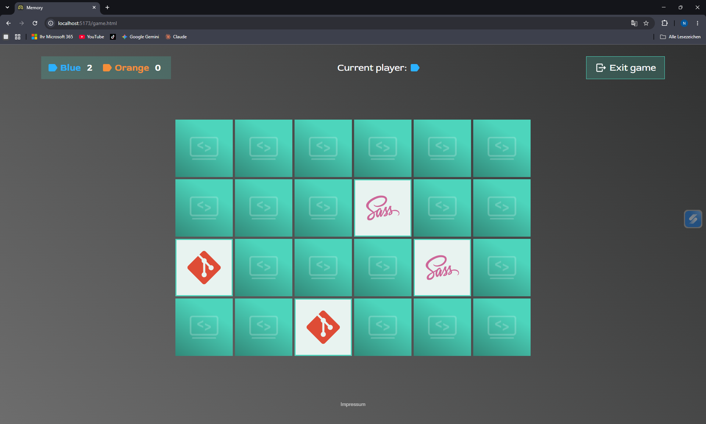

# Memory

A two-player memory card game for the browser, built with TypeScript, Vite and SCSS — no UI framework and no runtime dependencies.

Two players take turns revealing cards. Find a matching pair and you score a point and go again; miss and the turn passes to your opponent. Whoever holds the most pairs when the board is cleared wins.



## Features

- **Two themes** — *Code vibes* and *Gaming*, each with its own motifs, colors, card proportions and end screen
- **Three board sizes** — 16, 24 or 36 cards
- **Hot-seat multiplayer** — two players on one device, blue against orange
- **Live theme preview** on the settings page, driven by mouse *and* keyboard
- **Accessible by default** — semantic markup, `hidden` for state changes, decorative graphics hidden from screen readers
- **Fully typed** — TypeScript in `strict` mode, no `any`

## Getting started

Requires [Node.js](https://nodejs.org/) 20 or newer.

```bash
git clone git@github.com:NouBou1/memory_ts.git
cd memory_ts
npm install
npm run dev
```

The dev server opens http://localhost:5173 automatically.

## Scripts

| Script | What it does |
| --- | --- |
| `npm run dev` | Start the Vite dev server with hot reload |
| `npm run build` | Type-check, then build to `dist/` |
| `npm run preview` | Serve the production build locally |
| `npm run typecheck` | Run `tsc --noEmit` on its own |
| `npm run docs` | Generate the API documentation into `docs/` |
| `npm run docs:watch` | Regenerate the documentation on every change |

## Project structure

The app is a multi-page site: each HTML file has its own TypeScript entry point.

```
index.html      → src/home.ts        Start page
settings.html   → src/settings.ts    Theme, player and board size
game.html       → src/main.ts        The game itself
impressum.html  → src/impressum.ts   Legal notice

src/
├── types/card.ts           Shared data types
├── game/
│   ├── state.ts            Game logic — no DOM access
│   └── shuffle.ts          Fisher-Yates shuffle
├── ui/board.ts             Rendering the board into the DOM
├── data/
│   ├── themes.ts           Theme definitions
│   ├── settings-store.ts   Handover between pages
│   └── confetti.ts         Winner-screen graphics
├── styles/                 SCSS, organised by component
└── assets/                 Card motifs, icons, images
```

## How it works

The code is split so that each layer knows as little as possible about the others.

**`game/state.ts` holds the rules and touches no DOM.** It creates and mutates a single `GameState` object, and every function returns plain data. That keeps the rules readable on their own — and testable without a browser.

**`ui/board.ts` is the only place that writes cards into the DOM.** It reads a `<template>` from the page rather than building markup in JavaScript.

**`main.ts` connects the two** and owns everything time-based: a non-matching pair stays visible for 900 ms before it flips back, and the winner appears after a short interstitial screen.

**Settings travel through `sessionStorage`.** The settings page and the game are separate documents, so they share no memory. Everything read back is validated with type guards rather than trusted, and any doubt falls back to a default.

## Adding a theme

Themes are data, not code. Nothing in the game logic needs to change:

1. Drop the card motifs into `src/assets/images/cards/<your-theme>/`
2. Add your id to the `ThemeId` union in [`src/data/themes.ts`](src/data/themes.ts)
3. Add the matching entry to `THEMES` — TypeScript will tell you if you miss a field
4. Add a radio option to `settings.html` and extend the `isThemeId` guard in [`src/data/settings-store.ts`](src/data/settings-store.ts)

## Documentation

Every function, type and interface carries a [TSDoc](https://tsdoc.org/) comment, so hovering a symbol in your editor shows what it does.

For a browsable version:

```bash
npm run docs
```

Then open `docs/index.html`. The generated output is not committed — it is rebuilt from the source comments.

Note that TypeDoc only renders exported symbols. Internal helpers are documented too, but their descriptions live in the editor rather than in the HTML.

## Tech stack

| | |
| --- | --- |
| Language | TypeScript 5.9 (`strict`) |
| Build | Vite 7 |
| Styles | SCSS |
| Docs | TypeDoc 0.28 |

## License

ISC
